# MARKETTRACE AI

<p align="center">
  
  
  
  
  
  
  
  
</p>

---

> **"Don't just see what changed. Understand why — and what to do next."**

**MarketTrace AI** is an enterprise-grade **KPI Root-Cause Intelligence-to-Action Engine**. It bridges the critical *"Decision Gap"* in modern Business Intelligence by transforming raw metric movements into empirically validated root causes, traceable evidence graphs, persona-tailored narratives, and governed operational actions.

---

## 📑 Table of Contents

1. [Executive Summary](#-executive-summary)
2. [Problem Statement & The Decision Gap](#-problem-statement--the-decision-gap)
3. [The 6-Step Diagnostic Workflow](#-the-6-step-diagnostic-workflow)
4. [Implementation Approach & 17-Stage Intelligence Pipeline](#-implementation-approach--17-stage-intelligence-pipeline)
   - [Statistical & Mathematical Foundations](#statistical--mathematical-foundations)
   - [Transparent 7-Factor Evidence Scoring Formula](#transparent-7-factor-evidence-scoring-formula)
   - [Causal Validation & Temporal Ordering](#causal-validation--temporal-ordering)
   - [Uncertainty Guardrails & Responsible Abstention](#uncertainty-guardrails--responsible-abstention)
5. [Solution Architecture](#-solution-architecture)
   - [System Architecture Diagram](#system-architecture-diagram)
   - [End-to-End Data Flow](#end-to-end-data-flow)
   - [Core Component & Service Hierarchy](#core-component--service-hierarchy)
   - [Enterprise Governance, RBAC & Data Masking](#enterprise-governance-rbac--data-masking)
   - [Benchmark Scenarios](#benchmark-scenarios)
6. [Tech Stack & Dependencies](#-tech-stack--dependencies)
7. [Execution & Setup Instructions](#-execution--setup-instructions)
   - [Prerequisites](#prerequisites)
   - [Quick Start (Single Command)](#quick-start-single-command)
   - [Independent Component Execution](#independent-component-execution)
   - [Production Build & Preview](#production-build--preview)
   - [Generating Test Datasets](#generating-test-datasets)
8. [API Reference & REST Endpoints](#-api-reference--rest-endpoints)
9. [Project Directory Structure](#-project-directory-structure)
10. [Analyst Feedback Loop & Calibration](#-analyst-feedback-loop--calibration)

---

## 🌟 Executive Summary

Traditional Business Intelligence (Power BI, Tableau, Looker) provides descriptive dashboards that answer **"What changed?"** (e.g., *Revenue fell by 8.2% in August*). However, business leaders and analysts are left stranded when answering **"Why did it change?"** and **"What is the high-conviction next step?"**.

**MarketTrace AI** automates the entire diagnostic analytics lifecycle:
- **Detects** statistically significant anomalies across time-series KPIs using Holt-Winters and Z-Score algorithms.
- **Decomposes** variances hierarchically across multi-dimensional slices (Region $\to$ Segment $\to$ Product SKU).
- **Triangulates** structured movements against unstructured enterprise data (Salesforce CRM notes, Zendesk tickets, G2/NPS customer feedback, Gartner competitive intelligence).
- **Validates** competing hypotheses through Difference-in-Differences (DiD) and temporal precedence (Lag-15 lead/lag cross-correlation) to prevent correlation/causation confusion.
- **Synthesizes** persona-specific, hallucination-free narratives (Executive, Data Analyst, Sales Manager, Product Manager) with clickable citation lineage.
- **Recommends** governed, decision-rights-aware operational levers with telemetry monitoring plans.

---

## 🎯 Problem Statement & The Decision Gap

```
┌───────────────────────────┐         THE DECISION GAP          ┌───────────────────────────┐
│     TRADITIONAL B.I.      │    ❌ 80% Manual Investigation     │     BUSINESS DECISION     │
│    "Revenue fell 8.2%"    │ ═════════════════════════════════> │ "What action do we take?" │
│   (Descriptive Numbers)   │    ❌ Hallucinating GenAI LLMs    │    (Operational Action)   │
└───────────────────────────┘    ❌ No Causal Verification      └───────────────────────────┘
                                              ▲
                                              │
                                 ┌─────────────────────────┐
                                 │     MARKETTRACE AI      │
                                 │   Automated Diagnostic  │
                                 │    Triangulation & DiD  │
                                 └─────────────────────────┘
```

### The Three Critical Failures in Modern Enterprise Analytics:

1. **The 80/20 Investigation Tax**: Data analysts spend 80% of their bandwidth manually digging through siloed systems (CRM logs, support queues, client emails) to explain anomalous dashboard fluctuations.
2. **Generative AI Hallucinations**: Standard LLM-based analytics tools generate plausible-sounding explanations that lack underlying data lineage, temporal validation, and statistical significance testing.
3. **Correlation vs. Causation Confusion**: An external event (e.g., a competitor price cut) that occurred *after* an internal metric drop is frequently misdiagnosed as the root cause due to lack of chronological precedence checks.

---

## 🚀 The 6-Step Diagnostic Workflow

The platform provides a guided, interactive 6-stage investigation workflow:

```
  ┌──────────┐      ┌────────────┐      ┌─────────────┐      ┌──────────┐      ┌─────────┐      ┌─────┐
  │01 DETECT ├─────>│02DECOMPOSE├─────>│03INVESTIGATE├─────>│04VALIDATE├─────>│05EXPLAIN├─────>│06ACT│
  └──────────┘      └────────────┘      └─────────────┘      └──────────┘      └─────────┘      └─────┘
```

| Step | Stage Name | Purpose & Primary Action | Key Outputs |
| :--- | :--- | :--- | :--- |
| **01** | **Detect** | Ingests metric time-series and identifies statistically significant anomalies against rolling baselines. | Z-Scores, Holt-Winters 95% Confidence Intervals, Materiality Classification (High/Medium/Low). |
| **02** | **Decompose** | Isolates the primary loss driver across multi-dimensional hierarchies using additive variance math. | Dimensional Variance Tree, Waterfall Impact Chart, Primary Segment Isolation (e.g., APAC Enterprise = 62.2% loss). |
| **03** | **Investigate** | Triangulates structured variances across multi-source unstructured text corpora using RAG & NLP. | Correlated CRM opportunity loss logs, Zendesk P1 support tickets, customer NPS feedback, competitor market signals. |
| **04** | **Validate** | Evaluates multiple competing hypotheses ($H_1 \dots H_4$) using chronological ordering and Difference-in-Differences. | Temporal Precedence Verification, Treatment vs. Control Group Analysis, 7-Factor Weighted Evidence Scores. |
| **05** | **Explain** | Synthesizes role-tailored analytical narratives with clickable, grounded evidence lineage. | Executive, Data Analyst, Sales Manager, and Product Manager storylines with zero-hallucination citation links. |
| **06** | **Act** | Generates prioritized, controllable operational interventions bound to corporate decision rights. | Governed Action Levers, Expected Revenue/Ticket Impact, Assigned Owners, Pre-Configured Telemetry Monitoring Plans. |

---

## ⚙️ Implementation Approach & 17-Stage Intelligence Pipeline

The MarketTrace AI backend executes an orchestrated **17-Stage Analytical Pipeline** on every dataset or investigation request:

```
 ┌──────────────────────────────────────────────────────────────────────────────────────────────┐
 │                              17-STAGE INTELLIGENCE PIPELINE                                  │
 ├─────────────────────────┬────────────────────────────┬───────────────────────────────────────┤
 │ 1. Data Ingestion       │ 7. Structured Analysis     │ 13. Uncertainty Test & Guardrails     │
 │ 2. Data Validation      │ 8. Unstructured RAG        │ 14. Root-Cause Ranking                │
 │ 3. Semantic Contract    │ 9. Hypothesis Engine       │ 15. LLM Narrative Synthesis           │
 │ 4. Change Detection     │ 10. Evidence Engine        │ 16. Action Recommendations            │
 │ 5. KPI Decomposition    │ 11. Causal Analysis (DiD)  │ 17. Telemetry & Audit Persistence     │
 │ 6. Factor Discovery     │ 12. Evidence Scoring       │                                       │
 └─────────────────────────┴────────────────────────────┴───────────────────────────────────────┘
```

### Statistical & Mathematical Foundations

#### 1. Deterministic Change Detection (Z-Score & ARIMA)
Calculates historical rolling mean ($\mu$) and standard deviation ($\sigma$) over baseline periods:
$$Z = \frac{x_{\text{current}} - \mu}{\sigma}$$
An anomaly is triggered when $|Z| \ge 2.0$ ($p < 0.05$) or when the percentage deviation $|\Delta\%| \ge \text{Threshold}_{\text{materiality}}$ specified in the KPI semantic contract.

#### 2. Multi-Dimensional Additive Variance Decomposition
Measures each dimension slice's contribution to total metric contraction:
$$\text{Contribution Share } (\%) = \frac{\Delta \text{Slice Loss}}{\sum \Delta \text{Total Loss}} \times 100$$
For NovaCommerce August 2026:
$$\text{APAC Loss } (\$268\text{K}) / \text{Total Loss } (\$430\text{K}) = 62.2\% \text{ Additive Variance Share}$$

#### 3. Lead/Lag Cross-Correlation & Temporal Precedence
Quantifies chronological ordering between signal $X(t)$ (e.g., CRM pipeline drop) and KPI anomaly $Y(t)$ (e.g., recognized revenue drop):
$$r_{xy}(k) = \frac{\sum_{t} (X_t - \bar{X})(Y_{t+k} - \bar{Y})}{\sqrt{\sum (X_t - \bar{X})^2 \sum (Y_{t+k} - \bar{Y})^2}}$$
- **Hypothesis $H_1$ (ERP Connector Failure)**: Lead of $k = +15\text{ days}$ ($r = -0.84, p < 0.001$) $\to$ **Causally Preceding (Confirmed)**.
- **Hypothesis $H_2$ (CloudApex Discount)**: Lag of $k = -11\text{ days}$ (discount announced Aug 12, post-anomaly) $\to$ **Refuted as Root Cause**.

---

### Transparent 7-Factor Evidence Scoring Formula

Every hypothesis is assigned a calibrated, auditable confidence score ($0 \dots 100$) using explicit weighting:

$$\text{Score} = (0.30 \times E) + (0.20 \times T) + (0.15 \times S) + (0.15 \times C) + (0.10 \times P) + (0.05 \times Q) - (0.05 \times K)$$

| Factor | Description | Weight | NovaCommerce $H_1$ | NovaCommerce $H_2$ |
| :--- | :--- | :---: | :---: | :---: |
| **$E$ (Evidence Strength)** | Frequency and severity of corroborating unstructured signals | **30%** | $94$ (P1 tickets, CRM loss notes) | $72$ (Market reports) |
| **$T$ (Temporal Alignment)** | Precedence alignment with anomaly timeline | **20%** | $96$ (+15 days lead) | $35$ (-11 days post-anomaly) |
| **$S$ (Segment Overlap)** | Coincidence with the isolated dimensional segment | **15%** | $92$ (APAC Enterprise) | $68$ (General APAC) |
| **$C$ (Contribution Share)**| Share of overall dollar/metric variance explained | **15%** | $88$ ($62.2\%$ share) | $45$ ($17.4\%$ share) |
| **$P$ (Statistical Signal)** | Pearson correlation strength & significance level | **10%** | $95$ ($r = -0.84, p < 0.001$) | $65$ ($r = -0.42, p = 0.042$) |
| **$Q$ (Data Quality)** | Profiling completeness and null-rate confidence | **5%** | $94$ ($94\%$ profile quality) | $94$ ($94\%$ profile quality) |
| **$K$ (Contradiction Penalty)**| Penalty deduction for conflicting client/market evidence | **-5%** | $-4$ (Minor SMB outlier) | $-24$ (Direct quotes prioritizing stability over price) |
| **Final Calibrated Score** | **Weighted Composite Confidence** | **100%** | **87% (HIGH CONFIDENCE)** | **54% (REFUTED/WEAK)** |

---

### Causal Validation & Temporal Ordering

MarketTrace AI validates causality using **Difference-in-Differences (DiD)** against contemporaneous control groups:
- **Treatment Cohort (APAC Enterprise)**: Experienced **$-16.4\%$** renewal contraction following the v4.2 update.
- **Control Cohort (North America Enterprise)**: Experienced **$+0.8\%$** growth over the identical window.
- **Difference-in-Differences Effect**: **$-17.2\text{ percentage points}$** ($t = 4.12, p < 0.001$, Statistically Significant).

---

### Uncertainty Guardrails & Responsible Abstention

To enforce ethical and reliable AI behavior, the system executes explicit uncertainty guardrails:
1. **Ambiguous Evidence ($H_1 \approx H_2$, Delta $< 5.0\text{ pts}$)**: The engine triggers **`ABSTAIN`** status, displays competing explanations transparently, and outputs the exact missing data sources needed to break the tie.
2. **Sparse History ($< 180\text{ days}$)**: The engine triggers **`FALLBACK_PEER_GROUP`**, switching from ARIMA timeseries to comparative cohort benchmarking (e.g., comparing against prior product launches).

---

## 🏗 Solution Architecture

### System Architecture Diagram

```mermaid
graph TB
    subgraph CLIENT_LAYER ["Frontend Presentation Layer (React 18 + Vite + Tailwind)"]
        Landing["Landing Page / Console"]
        Dashboard["Intelligence Dashboard"]
        Studio["Data Studio (Dynamic Ingestion & Profiler)"]
        Workspace["Investigation Workspace (6-Stage Stepper)"]
        GovernanceUI["Governance, RBAC & Data Masking Hub"]
        LineageUI["Interactive Evidence Lineage Modal"]
        TelemetryUI["Real-Time Telemetry & Audit Modal"]
    end

    subgraph API_LAYER ["Backend API Gateway (Node.js + Express REST API)"]
        Router["/api Routes Dispatcher"]
        RBAC["RBAC & Role-Level Security Middleware"]
        ErrorHandler["Error & Telemetry Interceptor"]
    end

    subgraph ORCHESTRATION_LAYER ["Pipeline Orchestration Engine"]
        Orchestrator["PipelineOrchestrator (17 Sequential Stages)"]
    end

    subgraph SERVICE_LAYER ["Diagnostic Analytical Engines"]
        IngestService["DataIngestionService (CSV/JSON Parser)"]
        ProfileService["DataProfilingService (Schema & Quality Scorer)"]
        SemanticService["SemanticMappingService (KPI Contract Resolver)"]
        ChangeService["ChangeDetectionService (Z-Score & Holt-Winters)"]
        DecompService["DecompositionService (Additive Variance Tree)"]
        FactorService["FactorDiscoveryService (Correlation Matrix)"]
        RAGService["UnstructuredRagService (TF-IDF, Vectors & NLP)"]
        HypothesisService["HypothesisService (Competitive H1..H4 Generator)"]
        CausalService["CausalAnalysisService (Diff-in-Differences & Lag-15)"]
        ScoringService["EvidenceScoringService (7-Factor Weighted Formula)"]
        UncertaintyService["UncertaintyService (Guardrails & Abstention)"]
        NarrativeService["NarrativeService (Persona Story Synthesis + Gemini API)"]
        RecService["RecommendationService (Decision Rights & Levers)"]
    end

    subgraph STORAGE_LAYER ["Persistence & Semantic Registry"]
        KPIRegistry["Semantic KPI Contracts (revenue, conversion, churn, aov, orders)"]
        JSONStore["DBStore (datasets.json, analyses.json, audit.json, feedback.json)"]
        AuxData["Enterprise Mock Repositories (CRM, Zendesk, Feedback, Market)"]
    end

    CLIENT_LAYER -->|REST API Requests with x-role header| API_LAYER
    API_LAYER -->|Dispatches Validated Job| Orchestrator
    Orchestrator --> SERVICE_LAYER
    SERVICE_LAYER --> STORAGE_LAYER
```



---

### End-to-End Data Flow

```
[Raw Ingestion / CSV] 
       │
       ▼
[Data Profiling & Schema Quality Scorer]
       │
       ▼
[Semantic Contract Mapping (KPI Registry)]
       │
       ▼
[Change Detection (Z = -3.42, Anomaly Score 94)]
       │
       ▼
[Variance Decomposition (APAC Enterprise: 62.2% Loss Share)]
       │
       ▼
[Multi-Source RAG Extraction (Salesforce, Zendesk, NPS, Gartner)]
       │
       ▼
[Hypothesis Formulation & Causal DiD Validation]
       │
       ▼
[7-Factor Weighted Evidence Scoring (87% High Confidence)]
       │
       ▼
[Uncertainty Guardrails & Decision Bounds Check]
       │
       ▼
[Persona-Tailored Narrative Generation (Executive, Analyst, Sales, Product)]
       │
       ▼
[Governed Operational Recommendations & Telemetry Monitoring]
```

---

### Core Component & Service Hierarchy

```
server/src/
├── app.js                          # Express application configuration & middleware
├── server.js                       # Server bootstrap, port binding & database seeding
├── routes/
│   └── apiRoutes.js                # Complete REST API route definitions
├── controllers/
│   ├── pipelineController.js       # Ingestion, profiling, mapping, and pipeline execution
│   ├── dashboardController.js      # Global KPIs and active anomaly summaries
│   └── narrativeController.js      # Persona narrative and report generation
├── services/
│   ├── pipelineOrchestrator.js     # Master 17-stage intelligence pipeline orchestrator
│   ├── dataIngestionService.js     # Multi-format raw data parser (CSV, JSON, text)
│   ├── dataProfilingService.js     # Automated schema inference, null checks & quality scoring
│   ├── semanticMappingService.js   # KPI registry contract binding & dimension resolver
│   ├── changeDetectionService.js   # Z-Score, rolling mean & Holt-Winters anomaly detection
│   ├── decompositionService.js     # Multi-dimensional additive variance decomposition
│   ├── factorDiscoveryService.js   # Cross-system metric correlation & factor ranking
│   ├── structuredAnalysisService.js# Trend, waterfall, and temporal variance analysis
│   ├── unstructuredRagService.js   # Vector/TF-IDF text search, topic clustering & sentiment
│   ├── hypothesisService.js        # Competing root-cause hypothesis generator (H1..H4)
│   ├── evidenceService.js          # Supporting, contradictory, and missing evidence aggregator
│   ├── causalAnalysisService.js    # Difference-in-Differences and lag-15 precedence engine
│   ├── evidenceScoringService.js   # Transparent 7-factor weighted confidence scoring
│   ├── uncertaintyService.js       # Confidence delta guardrails & abstention decision logic
│   ├── rootCauseService.js         # Final root-cause ranking and priority sorting
│   ├── narrativeService.js         # Grounded persona narrative generation (with Gemini fallback)
│   ├── recommendationService.js    # Decision-rights-aware business levers & monitoring plans
│   ├── telemetryService.js         # Runtime metrics, token consumption, and latency logging
│   └── aiService.js                # AI model provider abstraction & data source manager
├── semantic/                       # Governed Semantic Contracts
│   ├── kpiRegistry.js              # Central semantic layer registry
│   ├── revenue.json                # Revenue contract schema, grain, and thresholds
│   ├── conversionRate.json         # Conversion Rate formula and dimension definitions
│   ├── customerChurn.json          # Customer Churn semantic specifications
│   ├── averageOrderValue.json      # Average Order Value calculations
│   └── orders.json                 # Transaction Volume definitions
└── db/
    ├── store.js                    # In-memory and file-backed JSON database store
    └── seed.js                     # Automatic bootstrap seeder for benchmark datasets
```

---

### Enterprise Governance, RBAC & Data Masking

MarketTrace AI implements enterprise-grade data security protocols:
- **Role-Based Access Control (RBAC)**: Enforces access tiers across **Executive**, **Data Analyst**, **Sales Manager**, and **Product Manager**.
- **Row-Level Security (RLS)**: Restricts regional access (e.g., Regional Managers can only query their designated territories).
- **Dynamic Data Masking**: Automatically redacts Personally Identifiable Information (PII) and PCI data in unstructured text:
  - *Customer Email*: `kenji.sato@tokyodigital.jp` $\to$ `k***o@tokyodigital.jp`
  - *Payment Method*: `Visa ending in 4921` $\to$ `•••• •••• •••• 4921`
  - *Employee Compensation*: `Commission $42,500` $\to$ `[REDACTED_CONFIDENTIAL]`
- **Immutable Security Audit Trail**: Logs every dataset upload, telemetry query, analysis run, and action execution with timestamps and policy statuses.

---

### Benchmark Scenarios

The platform includes 3 out-of-the-box benchmark test scenarios:

| Scenario | Identifier | Dataset | Anomaly Type | Engine Behavior |
| :--- | :--- | :--- | :--- | :--- |
| **Scenario A (High Confidence)** | `inv-novacommerce-01` | `sales.csv` | $-8.2\%$ Revenue Drop | Isolates APAC Enterprise ERP connector failure as primary root cause ($87\%$ confidence). Refutes competitor discount due to lack of temporal precedence. |
| **Scenario B (Abstain / Low Confidence)** | `inv-ambiguous-02` | `low_confidence.csv` | $-6.1\%$ Balanced Shift | Detects equal, competing drivers across marketing reallocation and pricing. Engine responsibly **ABSTAINS** and outputs missing data requirements. |
| **Scenario C (Sparse History)** | `inv-sparse-03` | `new_product.csv` | $18\text{ Days}$ Launch Telemetry | Baseline history insufficient for ARIMA ($< 180\text{ days}$). Switches to comparative peer-group launch cohort benchmarking. |

---

## 📦 Tech Stack & Dependencies

### Frontend Architecture
- **Framework**: [React 18.3.1](https://react.dev/) with [TypeScript 5.7.2](https://www.typescriptlang.org/)
- **Build Tool**: [Vite 6.1.0](https://vitejs.dev/) with `@vitejs/plugin-react`
- **Routing**: [React Router DOM 7.18.3](https://reactrouter.com/)
- **Styling**: [Tailwind CSS 3.4.17](https://tailwindcss.com/) with `postcss` and `autoprefixer`
- **Visualizations**: [Recharts 2.15.1](https://recharts.org/) (Custom Composed Anomaly Charts, Waterfall Drivers, Decomposition Trees)
- **Icons & UI Utilities**: [Lucide React 0.475.0](https://lucide.dev/), `clsx`, `tailwind-merge`
- **HTTP Client**: [Axios 1.20.0](https://axios-http.com/)

### Backend Architecture
- **Runtime**: [Node.js](https://nodejs.org/) (ES Modules mode `"type": "module"`)
- **Web Framework**: [Express.js 4.21.2](https://expressjs.com/)
- **CORS & Middleware**: `cors 2.8.5`, JSON/CSV parsers (50MB payload limits)
- **Process Orchestration**: [Concurrently 9.1.2](https://www.npmjs.com/package/concurrently)
- **Environment Management**: [Dotenv 16.4.7](https://www.npmjs.com/package/dotenv)
- **AI Integration**: Optional live Google Gemini 2.0 Flash integration with deterministic offline fallback

---

## 💻 Execution & Setup Instructions

### Prerequisites
- **Node.js**: `v18.0.0` or higher (`v20.x` recommended)
- **npm**: `v9.0.0` or higher

Check your installed versions:
```bash
node -v
npm -v
```

---

### Quick Start (Single Command)

Run both the Express backend API (`localhost:5000`) and the Vite React frontend (`localhost:3000`) concurrently:

1. **Clone or Navigate to the Project Root**:
   ```bash
   cd c:\Users\DELL\Desktop\MarketTrace_AI
   ```

2. **Install All Dependencies**:
   ```bash
   npm install
   ```

3. **Start Client & Server Concurrently**:
   ```bash
   npm run dev
   ```

4. **Access the Application**:
   Open your browser and navigate to:
   ```
   http://localhost:3000
   ```

*(Note: Vite is configured to automatically proxy all `/api/*` network requests to `http://localhost:5000`.)*

---

### Independent Component Execution

If you prefer to run the client and server in dedicated terminal sessions:

#### Terminal 1: Backend Server (Port 5000)
```bash
npm run server
```

#### Terminal 2: Frontend Client (Port 3000)
```bash
npm run client
```

---

### Production Build & Preview

To compile the TypeScript project and generate an optimized static production bundle:

```bash
# Type-check and compile with Vite
npm run build

# Preview the production build locally
npm run preview
```

---

### Generating Test Datasets

To regenerate or customize the 8 empirical test datasets in `/test-data` and `/public`:

```bash
node server/src/scripts/generateTestData.js
```

This generates:
- `sales.csv` (NovaCommerce August 2026 sales transactions)
- `crm.csv` (Salesforce enterprise opportunity and renewal logs)
- `support_tickets.csv` (Zendesk P1/P2/P3 integration sync tickets)
- `customer_feedback.csv` (NPS and G2 customer reviews)
- `market_signals.csv` (Gartner competitor launch events)
- `kpi_definitions.json` (Governed semantic contracts)
- `low_confidence.csv` (Scenario B ambiguous test set)
- `new_product.csv` (Scenario C 18-day sparse test set)

---

## 📡 API Reference & REST Endpoints

### 1. Data Ingestion & Profiling
| Method | Endpoint | Description |
| :--- | :--- | :--- |
| `POST` | `/api/datasets/upload` | Upload raw CSV/JSON dataset file content |
| `GET` | `/api/datasets` | Retrieve all registered datasets |
| `GET` | `/api/datasets/:id` | Get dataset details and row preview |
| `POST` | `/api/datasets/:id/profile` | Trigger automated schema profiling & quality check |
| `POST` | `/api/datasets/:id/map` | Map dataset columns to semantic KPI contract |

### 2. Analysis & Pipeline Orchestration
| Method | Endpoint | Description |
| :--- | :--- | :--- |
| `POST` | `/api/analysis/run` | Execute the full 17-stage intelligence pipeline |
| `GET` | `/api/analysis` | List all historical analysis runs |
| `GET` | `/api/analysis/:id` | Get complete investigation bundle |
| `GET` | `/api/analysis/:id/pipeline` | Get stage execution timings and logs |
| `GET` | `/api/analysis/:id/anomalies` | Get anomaly detection series and Z-scores |
| `GET` | `/api/analysis/:id/decomposition` | Get multi-dimensional variance tree and waterfall |
| `GET` | `/api/analysis/:id/factors` | Get correlated factor metrics and rankings |
| `GET` | `/api/analysis/:id/hypotheses` | Get evaluated hypotheses ($H_1 \dots H_4$) |
| `GET` | `/api/analysis/:id/evidence` | Get supporting, contradictory & missing evidence |
| `GET` | `/api/analysis/:id/causal` | Get Difference-in-Differences and lag-15 analysis |
| `GET` | `/api/analysis/:id/root-causes` | Get prioritized root causes with confidence ratings |
| `POST` | `/api/analysis/:id/narrative` | Generate role-specific explanation narrative |
| `GET` | `/api/analysis/:id/recommendations` | Get governed business actions & owners |

### 3. Dashboard, Governance & Feedback
| Method | Endpoint | Description |
| :--- | :--- | :--- |
| `GET` | `/api/dashboard/summary` | Global summary metrics and KPI cards |
| `GET` | `/api/anomalies` | Active enterprise anomaly list |
| `GET` | `/api/datasources` | Connected multi-source integrations status |
| `POST` | `/api/datasources/:id/sync` | Trigger real-time data source resync |
| `GET` | `/api/telemetry/:analysisId` | Execution telemetry (latency, tokens, cost) |
| `GET` | `/api/audit` | Immutable security & access audit logs |
| `GET` | `/api/kpis` | Governed semantic KPI catalog |
| `POST` | `/api/feedback` | Submit analyst calibration feedback |
| `GET` | `/api/feedback` | Retrieve historical feedback & calibrations |

---

## 📂 Project Directory Structure

```
MarketTrace_AI/
├── index.html                      # Single Page Application HTML entry point
├── package.json                    # Project configuration, scripts & dependencies
├── postcss.config.js               # PostCSS styling configuration
├── tailwind.config.js              # Tailwind CSS theme & token definitions
├── tsconfig.json                   # TypeScript compiler configuration
├── vite.config.ts                  # Vite build tool and API proxy settings
├── public/                         # Public static test datasets & assets
│   ├── sales.csv                   # Main NovaCommerce test dataset
│   ├── low_confidence.csv          # Scenario B ambiguous dataset
│   └── new_product.csv             # Scenario C sparse dataset
├── src/                            # React 18 Frontend Application
│   ├── App.tsx                     # Main router and route definitions
│   ├── main.tsx                    # React DOM root bootstrapping
│   ├── index.css                   # Global styles & Tailwind directives
│   ├── api/
│   │   └── client.ts               # Typed Axios HTTP client with role headers
│   ├── types/
│   │   └── index.ts                # TypeScript domain models & interfaces
│   ├── data/                       # Frontend mock data & governance configuration
│   │   ├── actionsData.ts          # Action recommendations definitions
│   │   ├── evidenceData.ts         # Multi-source evidence records
│   │   ├── governanceData.ts       # RBAC, masking & audit log definitions
│   │   ├── investigationsData.ts   # Pre-configured benchmark investigations
│   │   ├── kpiData.ts              # KPI definitions and thresholds
│   │   └── telemetryData.ts        # Runtime telemetry models
│   ├── components/
│   │   ├── common/                 # Reusable UI components (Card, Badge, Modal, Banner)
│   │   ├── governance/             # Semantic contract & RBAC modals
│   │   ├── layout/                 # Navigation header and sidebar
│   │   └── investigation/          # 6-Stage Investigation Step Views
│   │       ├── DetectView.tsx      # Step 1: Anomaly detection & time series
│   │       ├── DecomposeView.tsx   # Step 2: Variance decomposition & waterfall
│   │       ├── InvestigateView.tsx # Step 3: Unstructured RAG & signals
│   │       ├── ValidateView.tsx    # Step 4: Hypotheses & causal validation
│   │       ├── ExplainView.tsx     # Step 5: Multi-persona storytelling
│   │       ├── ActView.tsx         # Step 6: Governed action recommendations
│   │       ├── PipelineExecutionViewer.tsx # 17-stage live execution viewer
│   │       ├── DataLineageModal.tsx        # Traceable evidence graph
│   │       ├── TelemetryModal.tsx          # Latency, tokens & cost breakdown
│   │       └── FeedbackCard.tsx            # Analyst rating & calibration card
│   └── pages/
│       ├── LandingPage.tsx         # Platform landing page & hero
│       ├── IntelligenceDashboard.tsx# Executive KPI monitoring overview
│       ├── DataStudioPage.tsx      # Dynamic data ingestion, profiling & runner
│       ├── InvestigationWorkspace.tsx # Interactive 6-step workspace
│       ├── GovernancePage.tsx      # Enterprise RBAC & RLS simulator
│       └── FeedbackPage.tsx        # Calibration & feedback dashboard
├── server/                         # Node.js / Express Backend
│   ├── package.json                # Server dependency specifications
│   ├── .env                        # Server configuration (PORT, GEMINI_API_KEY)
│   └── src/
│       ├── app.js                  # Express setup, middleware & routes
│       ├── server.js               # Entrypoint & database bootstrap
│       ├── controllers/            # Route controllers
│       ├── routes/                 # API endpoint routers
│       ├── services/               # 17 analytical & intelligence services
│       ├── semantic/               # Governed KPI semantic contracts
│       ├── db/                     # Store and seeding utilities
│       └── scripts/                # Test data generation scripts
└── test-data/                      # Generated CSV and JSON test repositories
```

---

## 🔄 Analyst Feedback Loop & Calibration

MarketTrace AI incorporates a **Human-in-the-Loop (HITL)** continuous learning mechanism:

1. **Confidence Rating Feedback**: Analysts can rate root-cause diagnoses ($1 \dots 5\text{ Stars}$) and submit qualitative review notes.
2. **Dynamic Weight Calibration**: Feedback entries adjust hypothesis scoring penalties over time (e.g., dampening spurious competitor signals in favor of direct ERP telemetry).
3. **Audit Trail**: Every submission is recorded immutably in `server/src/data/db/feedback.json` and displayed in the Security & Governance Audit view.

---

<p align="center">
  <b>MarketTrace AI</b> — Empowering organizations to turn diagnostic analytics into decisive action.
</p>
